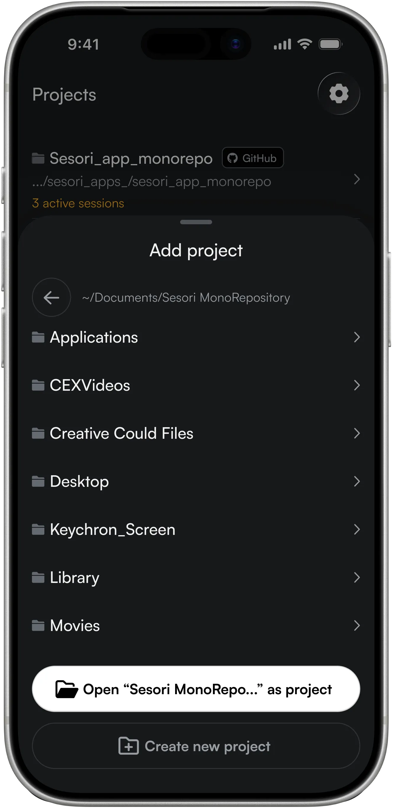
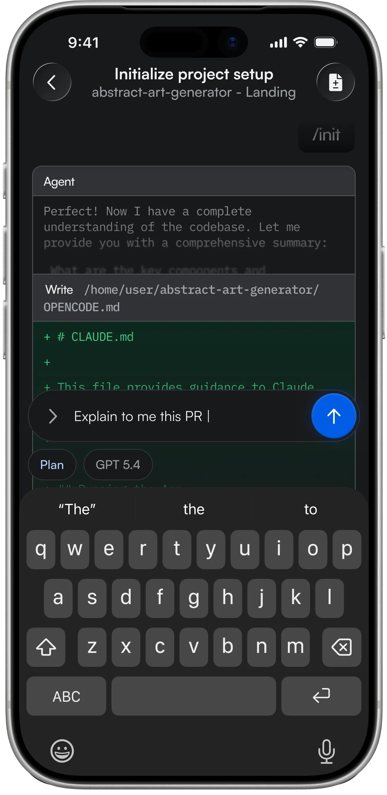
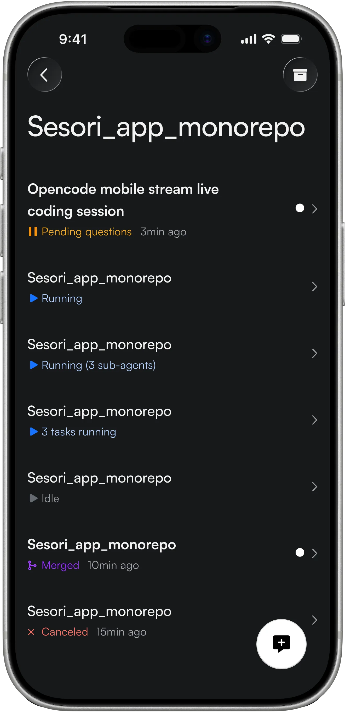

<p align="center">
  
</p>

<h1 align="center">Sesori</h1>

<p align="center">
  <strong>The open-source mobile client for <a href="https://opencode.ai">OpenCode</a>.</strong><br/>
  Run OpenCode from your phone.
</p>

<p align="center">
  <a href="https://github.com/sesori-ai"></a>
  <a href="https://github.com/sesori-ai/sesori_relay_server/blob/main/LICENSE"></a>
  <a href="https://apps.apple.com/app/sesori/id6760642500"></a>
  <a href="https://play.google.com/store/apps/details?id=com.sesori.app"></a>
  <a href="https://docs.sesori.com"></a>
  <a href="https://discord.gg/5KBC8dV9uR"></a>
</p>

<p align="center">
  <a href="https://sesori.com">Website</a> ·
  <a href="https://docs.sesori.com">Docs</a> ·
  <a href="https://sesori.com/blog">Blog</a> ·
  <a href="https://github.com/sesori-ai/sesori_apps_monorepo/releases">Changelog</a> ·
  <a href="https://x.com/sesori_ai">X</a> ·
  <a href="https://www.linkedin.com/company/sesori/">LinkedIn</a>
</p>

<p align="center">
  
  
  
</p>

---

## What is Sesori?

**Sesori is the open-source mobile client for [OpenCode](https://opencode.ai/docs/).** It lets you drive real OpenCode AI coding sessions from your iPhone or Android while the actual work runs on your laptop or desktop.

OpenCode is the AI coding engine. Sesori is the cockpit on your phone — built in the open, end-to-end encrypted, and local-first.

If you've searched for **OpenCode mobile**, **OpenCode iOS**, **OpenCode Android**, **OpenCode remote control**, **mobile AI coding**, or **AI coding from your phone** — that's what Sesori is built for.

---

## What you can do with Sesori

- **Run OpenCode from your phone** — full session control over a real OpenCode server on your machine.
- **Manage long-running agents** — leave the laptop, take the session with you.
- **Review file diffs & commit to GitHub** straight from the app.
- **Code with your voice** — speak prompts, answer permission requests, guide the agent hands-free.
- **Run multiple sessions in parallel** per project, each in its own context.
- **Get push notifications** the moment your agent finishes or needs you back.
- **Pick your model and agent** — anything OpenCode exposes (Claude, GPT, Gemini, KimiCode, OpenCode Go, …).
- **Local-first & end-to-end encrypted** — your code never leaves your machine. The relay sees only opaque binary.

Available now on **iOS** and **Android**. Desktop apps (macOS, Linux, Windows) coming soon.

---

## Quickstart

Connect your phone to OpenCode in a few minutes.

### 1. Install OpenCode

OpenCode is the AI coding engine Sesori connects to. Install it on your laptop or desktop:

```bash
curl -fsSL https://opencode.ai/install | bash
```

> **On Windows, use WSL.** Install OpenCode inside your WSL terminal, then run the rest of the setup — including `sesori-bridge` — from that same WSL terminal.

### 2. Connect your AI provider

```bash
opencode auth login
```

OpenCode supports Codex/GPT subscriptions, Anthropic API, Google Gemini, KimiCode, OpenCode Go, and more.

### 3. Install the Sesori Bridge

The **Sesori Bridge** is a small command-line tool that connects the Sesori app to OpenCode.

**macOS / Linux** (and Windows WSL — recommended path):

```bash
curl -fsSL https://sesori.com/install.sh | bash
```

**Windows (native PowerShell)** — use this only if you're running OpenCode natively on Windows rather than in WSL:

```powershell
irm https://sesori.com/install.ps1 | iex
```

> **Windows PATH.** The installer adds `sesori-bridge` to your PATH and refreshes the current PowerShell session. If `sesori-bridge` returns "command not found", open a new PowerShell window — or refresh PATH in this one:
>
> ```powershell
> $env:Path = [Environment]::GetEnvironmentVariable("Path","Machine") + ";" + [Environment]::GetEnvironmentVariable("Path","User")
> ```

### 4. Run the Bridge

```bash
sesori-bridge
```

Sign in with **GitHub** when prompted. The Bridge starts (or attaches to) a local OpenCode server and registers with the Sesori relay. Keep the terminal window open — your phone can only connect while the Bridge is running.

### 5. Install the Sesori app & sign in

- 📱 **iOS** → [App Store](https://apps.apple.com/app/sesori/id6760642500)
- 📱 **Android** → [Google Play](https://play.google.com/store/apps/details?id=com.sesori.app)

Sign in with the same GitHub account you used for the Bridge. You're connected.

Full walkthrough → **[docs.sesori.com/quickstart](https://docs.sesori.com/quickstart)**

---

## Platform support

| Component | macOS | Linux | Windows | iOS | Android |
|---|:-:|:-:|:-:|:-:|:-:|
| **Sesori App (mobile)** | — | — | — | ✅ | ✅ |
| **Sesori App (desktop)** | 🛠️ | 🛠️ | 🛠️ | — | — |
| **Sesori Bridge CLI** | ✅ | ✅ | ✅ native + WSL | — | — |
| **OpenCode** | ✅ | ✅ | ✅ via WSL | — | — |

✅ available now · 🛠️ coming soon

---

## How it works

```
┌─────────────┐    encrypted     ┌─────────────┐    local      ┌──────────┐
│ Sesori App  │ ──── relay ────▶ │   Bridge    │ ── localhost ▶│ OpenCode │
│ iOS/Android │   (E2EE only)    │ macOS/Linux │               │ on your  │
│             │                  │   Windows   │               │ machine  │
└─────────────┘                  └─────────────┘               └──────────┘
```

| Piece | What it does | Where it runs |
|---|---|---|
| **Sesori App** | The mobile interface you interact with | iOS, Android (desktop coming) |
| **Sesori Bridge CLI** | Connects the relay to OpenCode on your machine | macOS, Linux, Windows (native or WSL) |
| **Sesori Auth Server** | Sign-in flows; issues auth tokens | Cloud |
| **Sesori Relay Server** | Routes encrypted traffic between app and Bridge | Cloud |

Traffic between your phone and your machine is end-to-end encrypted with **X25519** (key exchange) and **XChaCha20-Poly1305** (channel) — the same modern cryptography secure messengers rely on. The relay forwards traffic but can't look inside it.

More detail → [How it works](https://docs.sesori.com/how-it-works).

---

## Use Sesori alongside OpenCode web

By default, `sesori-bridge` starts and manages its own OpenCode server. If you also want the **OpenCode web interface** open at the same time, start it first:

```bash
opencode web
```

Note the port it prints (for example, `4096`). Then start the Bridge against that same server with auto-start disabled:

```bash
sesori-bridge --no-auto-start --port 4096
```

Enable **workspaces** in the OpenCode web interface so both surfaces share the same sessions and project state.

---

## Open Source

**Sesori is open source.** Every piece that makes OpenCode mobile work is public — the app, the Bridge, the relay, the auth server. Audit the crypto, run it yourself, send PRs.

| Repo | What it is | Stack | License |
|---|---|---|---|
| [**sesori_apps_monorepo**](https://github.com/sesori-ai/sesori_apps_monorepo) | The Sesori iOS/Android app and the Bridge CLI | Dart / Flutter | [FSL-1.1-ALv2](https://github.com/sesori-ai/sesori_apps_monorepo/blob/main/LICENSE) (converts to Apache-2.0 after 2 years) |
| [**sesori_relay_server**](https://github.com/sesori-ai/sesori_relay_server) | End-to-end encrypted relay between phone and Bridge | Go | [Apache-2.0](https://github.com/sesori-ai/sesori_relay_server/blob/main/LICENSE) |
| [**sesori_auth_server**](https://github.com/sesori-ai/sesori_auth_server) | Sign-in (GitHub, Google, Apple, email) and token issuance | TypeScript | [Apache-2.0](https://github.com/sesori-ai/sesori_auth_server/blob/main/LICENSE) |

---

## Community & Support

- 🌐 [sesori.com](https://sesori.com)
- 📖 [docs.sesori.com](https://docs.sesori.com)
- 💬 [Discord](https://discord.gg/5KBC8dV9uR)
- 🐦 [X / Twitter](https://x.com/sesori_ai)
- 💼 [LinkedIn](https://www.linkedin.com/company/sesori/)
- 📝 [Blog](https://sesori.com/blog)
- 📦 [Releases & changelog](https://github.com/sesori-ai/sesori_apps_monorepo/releases)

**Security issue?** Don't open a public issue — email **hello@sesori.com**.

---

<p align="center">
  <strong>Sesori</strong> — Run OpenCode from your phone.
</p>
