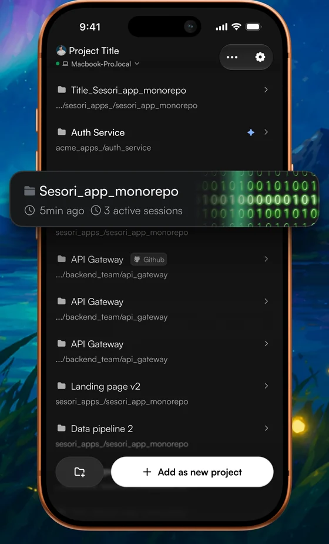
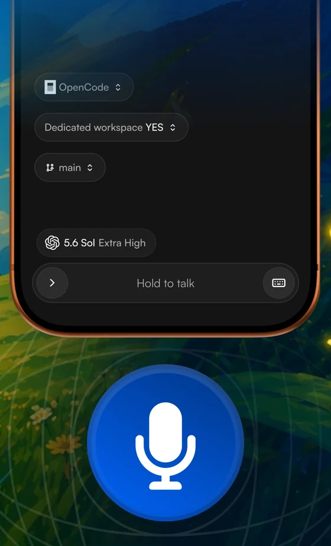
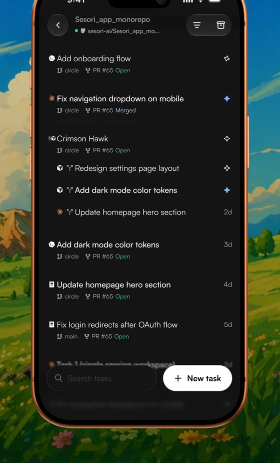

<p align="center">
  
</p>

<h1 align="center">Sesori</h1>

<p align="center">
  <strong>The open-source mobile client for your AI coding agent.</strong><br/>
  Works with <a href="https://opencode.ai/docs/">OpenCode</a>, <a href="https://developers.openai.com/codex/">Codex</a>, and <a href="https://cursor.com/docs/cli/overview">Cursor</a> — with more on the way.
</p>

<p align="center">
  <a href="https://github.com/sesori-ai"></a>
  <a href="https://github.com/sesori-ai/sesori_relay_server/blob/main/LICENSE"></a>
  <a href="https://apps.apple.com/app/sesori/id6760642500"></a>
  <a href="https://play.google.com/store/apps/details?id=com.sesori.app"></a>
  <a href="https://docs.sesori.com"></a>
  <a href="https://discord.gg/5KBC8dV9uR"></a>
</p>

<p align="center">
  <a href="https://sesori.com">Website</a> ·
  <a href="https://docs.sesori.com">Docs</a> ·
  <a href="https://sesori.com/blog">Blog</a> ·
  <a href="https://github.com/sesori-ai/sesori_apps_monorepo/releases">Changelog</a> ·
  <a href="https://x.com/sesori_ai">X</a> ·
  <a href="https://www.linkedin.com/company/sesori/">LinkedIn</a>
</p>

<p align="center">
  
  
  
</p>

---

## What is Sesori?

**Sesori is the open-source mobile client for your AI coding agent.** It lets you drive real AI coding sessions from your iPhone or Android while the actual work runs on your laptop or desktop.

Sesori works with **[OpenCode](https://opencode.ai/docs/)**, **[Codex](https://developers.openai.com/codex/)**, and **[Cursor](https://cursor.com/docs/cli/overview)** today, and more agents are on the way. Install whichever you prefer — the Sesori Bridge detects what's on your machine.

Your agent is the engine. Sesori is the cockpit on your phone — built in the open, end-to-end encrypted, and local-first.

If you've searched for **OpenCode mobile**, **OpenCode iOS**, **OpenCode Android**, **OpenCode remote control**, **Codex mobile**, **Codex CLI from your phone**, **Cursor mobile**, **Cursor agent remote control**, **mobile AI coding**, or **AI coding from your phone** — that's what Sesori is built for.

---

## What you can do with Sesori

- **Run your coding agent from your phone** — full session control over a real agent on your machine.
- **Use the agent you prefer** — OpenCode, Codex, or Cursor, through one app.
- **Manage long-running agents** — leave the laptop, take the session with you.
- **Review file diffs & commit to GitHub** straight from the app.
- **Code with your voice** — speak prompts, answer permission requests, guide the agent hands-free.
- **Run multiple sessions in parallel** per project, each in its own context.
- **Get push notifications** the moment your agent finishes or needs you back.
- **Pick your model and agent** — whatever your assistant exposes (Claude, GPT, Gemini, KimiCode, OpenCode Go, …).
- **Local-first & end-to-end encrypted** — your code never leaves your machine. The relay sees only opaque binary.

Available now on **iOS** and **Android**. Desktop apps (macOS, Linux, Windows) coming soon.

---

## Quickstart

Connect your phone to your coding agent in a few minutes.

### 1. Install an AI coding agent

You only need one. Pick whichever you prefer — you can install more than one and the Bridge will detect them all.

<details>
<summary><strong>OpenCode</strong></summary>

```bash
curl -fsSL https://opencode.ai/install | bash
opencode auth login
```

> **On Windows, use WSL.** Install OpenCode inside your WSL terminal, then run the rest of the setup — including `sesori-bridge` — from that same WSL terminal.

OpenCode supports GPT subscriptions, Anthropic API, Google Gemini, KimiCode, OpenCode Go, and more.

</details>

<details>
<summary><strong>Codex</strong></summary>

```bash
curl -fsSL https://chatgpt.com/codex/install.sh | sh
codex login
```

On Windows, Codex installs natively — WSL is not required:

```powershell
powershell -ExecutionPolicy ByPass -c "irm https://chatgpt.com/codex/install.ps1 | iex"
```

</details>

<details>
<summary><strong>Cursor</strong></summary>

```bash
curl https://cursor.com/install -fsS | bash
cursor-agent login
```

On Windows:

```powershell
irm 'https://cursor.com/install?win32=true' | iex
```

> **Cursor must be signed in** before the Bridge can use it. Check with `cursor-agent status`.

</details>

### 2. Install the Sesori Bridge

The **Sesori Bridge** is a small command-line tool that connects the Sesori app to your agent.

**macOS / Linux** (and Windows WSL — recommended path):

```bash
curl -fsSL https://sesori.com/install.sh | bash
```

**Windows (native PowerShell)** — use this if you're running your agent natively on Windows rather than in WSL:

```powershell
irm https://sesori.com/install.ps1 | iex
```

> **Windows PATH.** The installer adds `sesori-bridge` to your PATH and refreshes the current PowerShell session. If `sesori-bridge` returns "command not found", open a new PowerShell window — or refresh PATH in this one:
>
> ```powershell
> $env:Path = [Environment]::GetEnvironmentVariable("Path","Machine") + ";" + [Environment]::GetEnvironmentVariable("Path","User")
> ```

### 3. Run the Bridge

```bash
sesori-bridge
```

Pick a sign-in method when prompted — **GitHub** is recommended. The Bridge detects your installed agents, starts (or attaches to) the one you're using, and registers with the Sesori relay. Keep the terminal window open — your phone can only connect while the Bridge is running.

To see which agents the Bridge found:

```bash
sesori-bridge config plugins
```

### 4. Install the Sesori app & sign in

- 📱 **iOS** → [App Store](https://apps.apple.com/app/sesori/id6760642500)
- 📱 **Android** → [Google Play](https://play.google.com/store/apps/details?id=com.sesori.app)

Sign in with the same account and method you used for the Bridge. You're connected.

Full walkthrough → **[docs.sesori.com/quickstart](https://docs.sesori.com/quickstart)**

---

## Platform support

| Component | macOS | Linux | Windows | iOS | Android |
|---|:-:|:-:|:-:|:-:|:-:|
| **Sesori App (mobile)** | — | — | — | ✅ | ✅ |
| **Sesori App (desktop)** | 🛠️ | 🛠️ | 🛠️ | — | — |
| **Sesori Bridge CLI** | ✅ | ✅ | ✅ native + WSL | — | — |
| **OpenCode** | ✅ | ✅ | ✅ via WSL | — | — |
| **Codex** | ✅ | ✅ | ✅ native | — | — |
| **Cursor** | ✅ | ✅ | ✅ native | — | — |

✅ available now · 🛠️ coming soon

---

## How it works

```
┌─────────────┐    encrypted     ┌─────────────┐    local      ┌──────────────┐
│ Sesori App  │ ──── relay ────▶ │   Bridge    │ ── localhost ▶│ Your agent   │
│ iOS/Android │   (E2EE only)    │ macOS/Linux │               │ OpenCode ·   │
│             │                  │   Windows   │               │ Codex·Cursor │
└─────────────┘                  └─────────────┘               └──────────────┘
```

| Piece | What it does | Where it runs |
|---|---|---|
| **Sesori App** | The mobile interface you interact with | iOS, Android (desktop coming) |
| **Sesori Bridge CLI** | Connects the relay to the coding agent on your machine | macOS, Linux, Windows (native or WSL) |
| **Sesori Auth Server** | Sign-in flows; issues auth tokens | Cloud |
| **Sesori Relay Server** | Routes encrypted traffic between app and Bridge | Cloud |

The Bridge talks to each agent through its own adapter, which is how new agents get added without changing anything on your side.

Traffic between your phone and your machine is end-to-end encrypted with **X25519** (key exchange) and **XChaCha20-Poly1305** (channel) — the same modern cryptography secure messengers rely on. The relay forwards traffic but can't look inside it.

More detail → [How it works](https://docs.sesori.com/how-it-works).

---

## Use Sesori alongside OpenCode web

By default, `sesori-bridge` starts and manages its own OpenCode server. If you also want the **OpenCode web interface** open at the same time, start it first:

```bash
opencode web
```

Note the port it prints (for example, `4096`). Then start the Bridge against that same server with auto-start disabled:

```bash
sesori-bridge --opencode-no-auto-start --opencode-port 4096
```

`--opencode-no-auto-start` always needs `--opencode-port` alongside it. Enable **workspaces** in the OpenCode web interface so both surfaces share the same sessions and project state.

---

## Open Source

**Sesori is open source.** Every piece that makes mobile AI coding work is public — the app, the Bridge, the relay, the auth server. Audit the crypto, run it yourself, send PRs.

| Repo | What it is | Stack | License |
|---|---|---|---|
| [**sesori_apps_monorepo**](https://github.com/sesori-ai/sesori_apps_monorepo) | The Sesori iOS/Android app and the Bridge CLI | Dart / Flutter | [FSL-1.1-ALv2](https://github.com/sesori-ai/sesori_apps_monorepo/blob/main/LICENSE) (converts to Apache-2.0 after 2 years) |
| [**sesori_relay_server**](https://github.com/sesori-ai/sesori_relay_server) | End-to-end encrypted relay between phone and Bridge | Go | [Apache-2.0](https://github.com/sesori-ai/sesori_relay_server/blob/main/LICENSE) |
| [**sesori_auth_server**](https://github.com/sesori-ai/sesori_auth_server) | Sign-in (GitHub, Google, Apple, email) and token issuance | TypeScript | [Apache-2.0](https://github.com/sesori-ai/sesori_auth_server/blob/main/LICENSE) |

---

## Community & Support

- 🌐 [sesori.com](https://sesori.com)
- 📖 [docs.sesori.com](https://docs.sesori.com)
- 💬 [Discord](https://discord.gg/5KBC8dV9uR)
- 🐦 [X / Twitter](https://x.com/sesori_ai)
- 💼 [LinkedIn](https://www.linkedin.com/company/sesori/)
- 📝 [Blog](https://sesori.com/blog)
- 📦 [Releases & changelog](https://github.com/sesori-ai/sesori_apps_monorepo/releases)

---

<p align="center">
  <strong>Sesori</strong> — Run your AI coding agent from your phone.
</p>
