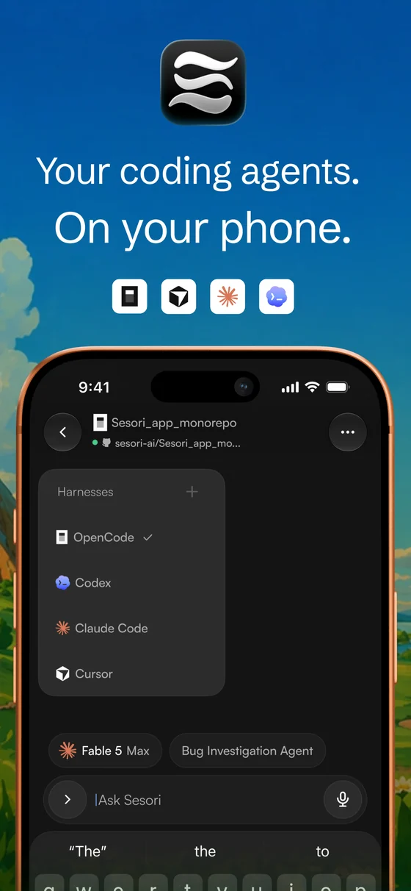
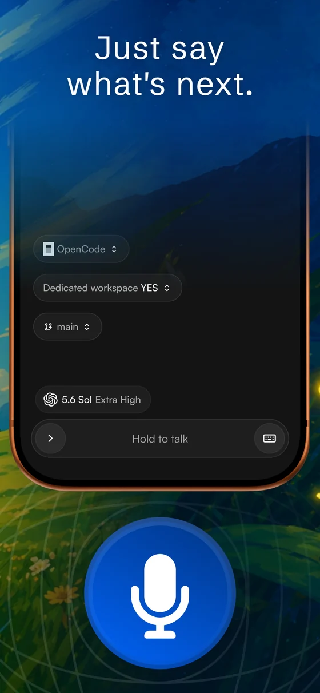
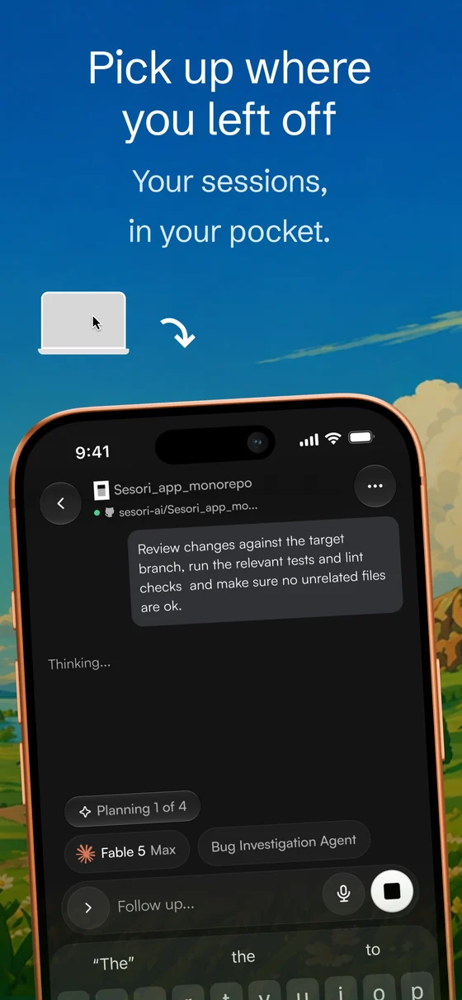

<p align="center">
  
</p>

<h1 align="center">Your coding agents. On your phone.</h1>

<p align="center">
  <strong>Run Claude Code, Codex, OpenCode, Cursor, GitHub Copilot, Antigravity, and five more from your iPhone or Android.</strong><br/>
  The agent keeps working on your machine, with your repo and your logins. You steer it from anywhere.<br/>
  End-to-end encrypted. Local-first. Built in the open.
</p>

<p align="center">
  <a href="https://apps.apple.com/app/sesori/id6760642500"></a>
  <a href="https://play.google.com/store/apps/details?id=com.sesori.app"></a>
  <a href="https://github.com/sesori-ai/sesori_apps_monorepo/releases"></a>
  <a href="https://github.com/sesori-ai/sesori_apps_monorepo"></a>
  <a href="https://docs.sesori.com"></a>
  <a href="https://discord.gg/5KBC8dV9uR"></a>
</p>

<p align="center">
  <a href="https://claude.com/product/claude-code">Claude Code</a> ·
  <a href="https://developers.openai.com/codex/">Codex</a> ·
  <a href="https://opencode.ai">OpenCode</a> ·
  <a href="https://cursor.com/docs/cli/overview">Cursor</a> ·
  <a href="https://github.com/github/copilot-cli">GitHub Copilot</a> ·
  <a href="https://antigravity.google/">Antigravity</a> ·
  <a href="https://docs.x.ai/build/overview">Grok Build</a> ·
  <a href="https://github.com/deepseek-ai/DeepSeek-Harness">DeepSeek</a> ·
  <a href="https://hermes-agent.nousresearch.com/">Hermes Agent</a> ·
  <a href="https://pi.dev">Pi</a> ·
  <a href="https://omp.sh">Oh My Pi</a>
</p>

<p align="center">
  
  
  
</p>

---

## Why Sesori

- **11 coding agents, one app.** Claude Code, Codex, OpenCode, Cursor, GitHub Copilot, Google Antigravity, Grok Build, DeepSeek Harness, Hermes Agent, Pi, and Oh My Pi. Pick one per session. Run several side by side on the same machine.
- **Real sessions, not a chat wrapper.** The agent runs on your laptop, desktop, or a headless VM, with your repo, your tools, and your credentials. Sesori streams the session to your phone and hands you the controls.
- **Nothing to expose.** No VPN, no tunnel, no open ports. Your phone and your machine do an X25519 key exchange and encrypt every message with XChaCha20-Poly1305. The relay only forwards ciphertext.
- **Three commands to get going.** Install the app, install the Bridge, run it. No agent installed yet? Sesori can download one for you.

---

## What you can do from your phone

- **Start and steer sessions** on any project on your machine. Browse folders, add projects, and choose the agent, then the model, effort, and mode it exposes.
- **Answer the agent.** Approve or reject permission requests, answer its questions, queue follow-ups while it works, and stop a task the moment it goes sideways.
- **Follow sub-agents.** Claude Code, Codex, OpenCode, and DeepSeek sub-agents show up as child sessions with live transcripts, so background work never happens out of sight.
- **Review the diff.** A File Changes view per session, with a diff for every file plus the branch and pull request status.
- **Run sessions in parallel.** Dedicated workspaces give each session its own Git worktree and branch, so two agents can touch the same file without colliding.
- **Talk instead of type.** Hold to record, review the transcript, send. Attach screenshots and mockups too.
- **Get pinged when it matters.** Push notifications the moment the agent finishes or needs you back, with the session name in the notification.
- **Install agents from the app.** Settings → Harnesses shows what is installed and what needs a sign-in, and can download a pinned copy of OpenCode, Codex, Copilot, Cursor, Pi, Oh My Pi, or DeepSeek Harness. Managed copies keep themselves updated. Codex can even sign in from your phone.
- **Keep your setup.** Sesori drives the agents, model providers, and permission settings you already have. It adds a remote, not another vendor account.

---

## Get started in 3 steps

### 1. Get the app

📱 [App Store](https://apps.apple.com/app/sesori/id6760642500) · 📱 [Google Play](https://play.google.com/store/apps/details?id=com.sesori.app)

### 2. Install the Bridge where your code lives

The Bridge is a small command-line tool that connects the app to the agents on your machine. Laptop, desktop, or a [headless VM](https://github.com/sesori-ai/sesori_apps_monorepo/blob/main/docs/SETUP_HEADLESS_VM.md) all work.

**macOS / Linux**

```bash
curl -fsSL https://sesori.com/install.sh | bash
```

**Windows (PowerShell)**

```powershell
irm https://sesori.com/install.ps1 | iex
```

Prefer npm or bun? `npx @sesori/bridge` or `bunx @sesori/bridge` installs the same thing.

### 3. Run it and sign in

```bash
sesori-bridge
```

Sign in with the same account in the app and in the Bridge. They pair automatically over the encrypted relay, even on different networks.

Then, in the app, open **Settings → Harnesses**. Agents already on your machine are detected; tap **Install runtime** for any you are missing. Open a project, tap **New session**, pick a **Coding tool**, and go.

Full walkthrough → **[docs.sesori.com/get-started/quickstart](https://docs.sesori.com/get-started/quickstart)** · Bridge commands and options → **[Bridge guide](https://docs.sesori.com/setup/set-up-the-bridge)**

---

## Supported coding agents

| Agent | Install from the app | Notes |
|---|:-:|---|
| [Claude Code](https://claude.com/product/claude-code) (Anthropic) | – | Standard and plan modes, with permission prompts on your phone |
| [Codex](https://developers.openai.com/codex/) (OpenAI) | ✅ | Can sign in from your phone |
| [OpenCode](https://opencode.ai) | ✅ | Bridge-managed server; can also attach to your running `opencode web` |
| [Cursor](https://cursor.com/docs/cli/overview) | ✅ macOS, Linux | Windows: use your own install |
| [GitHub Copilot CLI](https://github.com/github/copilot-cli) (GitHub) | ✅ | Needs an eligible Copilot account |
| [Antigravity](https://antigravity.google/) (Google) | – | Google's coding agent, signed in with your Google account |
| [Grok Build](https://docs.x.ai/build/overview) (xAI) | – | Text prompts only for now, no image attachments |
| [DeepSeek Harness](https://github.com/deepseek-ai/DeepSeek-Harness) (DeepSeek) | ✅ | Through Sesori's open-source [ACP adapter](https://github.com/sesori-ai/sesori-deepseek-acp) |
| [Hermes Agent](https://hermes-agent.nousresearch.com/) (Nous Research) | – | |
| [Pi](https://pi.dev) | ✅ | |
| [Oh My Pi](https://omp.sh) | ✅ | |

✅ Sesori downloads a pinned, checksummed copy from **Settings → Harnesses**, keeps it updated, and never touches a system-wide install. Everything else uses the agent already on your machine.

Each agent exposes its own models, sub-agents, slash commands, modes, and permission prompts, and Sesori shows whatever the agent supports. Setup, platform, and safety notes per agent → [Choose an AI coding assistant](https://docs.sesori.com/setup/choose-a-harness). Feature-by-feature detail → [capability matrix](https://github.com/sesori-ai/sesori_apps_monorepo/blob/main/docs/HARNESS_CAPABILITIES.md).

---

## Platform support

| | macOS | Linux | Windows | iOS | Android |
|---|:-:|:-:|:-:|:-:|:-:|
| **Sesori app** | 🛠️ | 🛠️ | — | ✅ | ✅ |
| **Sesori Bridge** | ✅ | ✅ | ✅ | — | — |

✅ available now · 🛠️ in development ([get notified](https://sesori.com/early-access))

---

## How it works

```
┌───────────────┐     encrypted relay      ┌───────────────┐      localhost      ┌────────────────────┐
│  Sesori app   │ ◀──────────────────────▶ │ Sesori Bridge │ ◀─────────────────▶ │  Your coding agent │
│ iOS · Android │    (ciphertext only)     │ mac·Linux·Win │                     │ Claude Code, Codex,│
└───────────────┘                          └───────────────┘                     │ OpenCode, Cursor … │
                                                                                 └────────────────────┘
```

The Bridge runs next to your agent and talks to it locally. Your phone and the Bridge perform an ephemeral X25519 key exchange, then encrypt every message with XChaCha20-Poly1305, the same cryptography secure messengers use. The relay routes opaque frames between them and cannot read them. Your repository and the agent itself stay on your machine.

More detail → [How it works](https://docs.sesori.com/get-started/how-it-works) · [Security and privacy](https://docs.sesori.com/get-started/security-and-privacy)

---

## Built in the open

Every piece that makes this work is public: the app, the Bridge, the relay, the auth server, and the DeepSeek adapter. Audit the crypto, read the plugin code, send PRs.

| Repo | What it is | Stack | License |
|---|---|---|---|
| [**sesori_apps_monorepo**](https://github.com/sesori-ai/sesori_apps_monorepo) | The iOS/Android app, the Bridge CLI, and one plugin package per agent | Dart / Flutter | [FSL-1.1-ALv2](https://github.com/sesori-ai/sesori_apps_monorepo/blob/main/LICENSE) (becomes Apache-2.0 after two years) |
| [**sesori_relay_server**](https://github.com/sesori-ai/sesori_relay_server) | End-to-end encrypted relay between phone and Bridge | Go | [Apache-2.0](https://github.com/sesori-ai/sesori_relay_server/blob/master/LICENSE) |
| [**sesori_auth_server**](https://github.com/sesori-ai/sesori_auth_server) | Sign-in (GitHub, Google, Apple, email) and token issuance | TypeScript | [Apache-2.0](https://github.com/sesori-ai/sesori_auth_server/blob/master/LICENSE) |
| [**sesori-deepseek-acp**](https://github.com/sesori-ai/sesori-deepseek-acp) | ACP adapter that lets Sesori drive DeepSeek Harness | TypeScript | [MIT](https://github.com/sesori-ai/sesori-deepseek-acp/blob/main/LICENSE) |

Want to add an agent? Each one is a self-contained plugin package. Start with [CONTRIBUTING.md](https://github.com/sesori-ai/sesori_apps_monorepo/blob/main/docs/CONTRIBUTING.md).

---

## Community & support

- 🌐 [sesori.com](https://sesori.com) · 📝 [Blog](https://sesori.com/blog)
- 📖 [Docs](https://docs.sesori.com) · [Quickstart](https://docs.sesori.com/get-started/quickstart) · [FAQ](https://docs.sesori.com/user-guide/faq) · [Troubleshooting](https://docs.sesori.com/help/troubleshooting)
- 💬 [Discord](https://discord.gg/5KBC8dV9uR)
- 🐦 [X / Twitter](https://x.com/sesori_ai) · 💼 [LinkedIn](https://www.linkedin.com/company/sesori/)
- 📦 [Releases & changelog](https://github.com/sesori-ai/sesori_apps_monorepo/releases)

---

<p align="center">
  <strong>Leave your laptop. Take the session.</strong>
</p>
